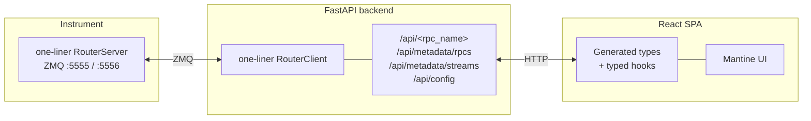

# Instrument UI Template

A starter template for building a **web UI in front of instrument software** that is already wired up to [`one-liner`](https://github.com/AllenNeuralDynamics/one-liner) and exposes a `RouterServer`.

The template gives you:

- A **FastAPI backend** that spins up a `one-liner` `RouterClient` at startup, auto-discovers every RPC and stream exposed by the instrument, and turns them into typed HTTP endpoints (plus `/api/metadata/*` endpoints describing them).
- A **React + TypeScript frontend** (Vite + Mantine + TanStack Router/Query + Tailwind) with a code-generated, type-safe client for every RPC — no manual endpoint wiring on either side.
- A **single `config.json`** at the repo root that both sides read from.

Use it as scaffolding: keep the RPC plumbing, replace the example pages with instrument-specific views.


## Table of contents

- [Instrument UI Template](#instrument-ui-template)
  - [Table of contents](#table-of-contents)
  - [Architecture](#architecture)
  - [Prerequisites](#prerequisites)
  - [Quick start](#quick-start)
  - [Configuration](#configuration)
  - [Repository layout](#repository-layout)
  - [Adapting the template](#adapting-the-template)
  - [Tooling](#tooling)
  - [Roadmap / known gaps](#roadmap--known-gaps)

## Architecture



- The **instrument** already runs a `RouterServer` (this template does not start one).
- The **backend** connects a `RouterClient` on startup, calls `get_rpc_configurations()` / `get_stream_configurations()`, and registers one `POST /api/<rpc_name>` route per RPC. Each route forwards `kwargs` through `client.call_by_name(...)`.
- The **frontend** pulls `/api/metadata/rpcs` at build (or dev-server) time, generates a TypeScript endpoint map + JSON-Schema-based param validation, and exposes it through typed hooks.


## Prerequisites

- **Python** ≥ 3.12 with [uv](https://docs.astral.sh/uv/) installed.
- **Node.js** ≥ 20 with npm.
- An instrument process running a `one-liner` `RouterServer` reachable over ZMQ (defaults: `tcp://localhost:5555` for RPC, `tcp://localhost:5556` for broadcasts).


## Quick start

**1. Start the instrument's `RouterServer`** (out of scope — this is your instrument software).

**2. Configure** — edit [config.json](config.json) at the repo root (see [Configuration](#configuration)).

**3. Backend:**

```powershell
cd backend
uv sync
uv run python -m web_ui_backend.main
```

The backend listens on `http://localhost:8000`. Health check: `GET /`. OpenAPI docs: `http://localhost:8000/docs`.

Optional flags:

```powershell
uv run python -m web_ui_backend.main --config path\to\config.json --log-level DEBUG
```

**4. Frontend:**

```powershell
cd frontend
npm install
npm run dev
```

`npm run dev` runs a `predev` step that:

1. Waits for the backend's `/api/metadata/rpcs` endpoint to come up.
2. Generates TypeScript types + an endpoint registry from that live schema (see [Code generation](#code-generation-rpc--typescript)).

The dev server then starts on `http://localhost:5173` and proxies `/api/*` to the backend.

## Configuration

The single source of truth is [config.json](config.json) at the repo root:

```json
{
  "ui": {
    "title": "Micetosis Template",
    "rpcs_endpoint": "/api/metadata/rpcs",
    "streams_endpoint": "/api/metadata/streams"
  },
  "server": {
    "url": "http://127.0.0.1",
    "port": "8000"
  }
}
```

- **`ui.*`** — forwarded to the browser via `GET /api/config`. Safe to expose (title, metadata endpoint paths, feature flags).
- **`server.*`** — server-only. Never exposed to the browser. Extend this section with instrument-specific settings (ZMQ ports, database URIs, secrets, etc.).

The backend loads and validates this file with Pydantic (see [backend/src/web_ui_backend/config.py](backend/src/web_ui_backend/config.py)). Missing fields fall back to model defaults; a missing file logs a warning and uses all defaults.

To point the backend at a different file:

```powershell
uv run python -m web_ui_backend.main --config C:\path\to\other-config.json
```

## Repository layout

```
.
├── config.json                   # Shared runtime config (backend + frontend)
├── backend/                      # FastAPI service (uv-managed)
│   └── src/web_ui_backend/
│       ├── main.py               # CLI entrypoint (uvicorn runner)
│       ├── app.py                # FastAPI run entrypoint (debugging)
│       ├── app_factory.py        # create_app(config) — wires middleware + routers
│       ├── router_factory.py     # Maps RouterClient RPCs into FastAPI routes
│       ├── config.py             # Config schema + load_config()
│       └── metadata_model.py     # RPCMetadata / StreamMetadata schemas
└── frontend/                     # Vite + React + TS
    ├── scripts/
    │   └── generate-rpc-types.mjs  # Fetches /api/metadata/rpcs → typed client
    └── src/
        ├── main.tsx
        ├── app/                  # Root providers, router, top-level routes
        ├── components/           # Reusable UI (layouts, ui/, errors/)
        ├── features/             # Feature-scoped code (example/ is the demo)
        ├── hooks/
        │   ├── use-config.ts     # Reads /api/config
        │   └── one-liner-router/ # RPC client + generated types
        │       ├── call-rpc.ts   # fetch wrapper + error classes
        │       ├── typed-hooks.ts# useRPCAction / useRPCData facade
        │       ├── validation.ts # Ajv JSON-Schema validation
        │       ├── registry.ts   # Metadata registry hooks
        │       ├── index.ts      # Public barrel
        │       └── generated/    # ⚙️ Codegen output (do not hand-edit)
        └── lib/                  # mantine-theme, react-query client
```

The project loosely follows the [bulletproof-react](https://github.com/alan2207/bulletproof-react) structure (`app/`, `features/`, `components/`, `hooks/`, `lib/`).

## Adapting the template

The template ships with a demo route at `/example` showing all pieces working end-to-end (metadata inspection, fixed-name RPC action/data calls, generic RPC caller). To turn this into your own instrument UI:

1. **Point at your instrument.** Update `config.json` (`server.router_client.*`) so the backend can connect. Restart the backend.
2. **Regenerate RPC types.** `npm run gen:rpc`. The `generated/` folder will now reflect your RPCs.
3. **Delete the demo feature.** Remove [frontend/src/features/example](frontend/src/features/example) and the `example.tsx` route.
4. **Add your own features.** Create `src/features/<your-feature>/components/` and a matching file-based route in `src/app/routes/`. Use `useRPCAction` / `useRPCData` with your generated RPC names — autocomplete and typechecking work out of the box.
5. **Theme.** Adjust `frontend/src/lib/mantine-theme.ts` and Tailwind config; swap the logo in [frontend/src/app/routes/index.tsx](frontend/src/app/routes/index.tsx).
6. **Rename the Python package.** `web_ui_backend` is generic — rename to something instrument-specific if you plan to publish (cookiecutter support is on the [roadmap](#roadmap--known-gaps)).

## Tooling

| Tool              | Purpose           | Command                                   |
| ----------------- | ----------------- | ----------------------------------------- |
| `uv`              | Python env + deps | `uv sync`, `uv add <pkg>`, `uv run <cmd>` |
| `ruff`            | Python lint       | `uv run ruff check`                       |
| `mypy`            | Python typecheck  | `uv run mypy`                             |
| `pytest`          | Python tests      | `uv run pytest`                           |
| `oxlint`          | JS/TS lint (fast) | `npm run lint` / `npm run lint:fix`       |
| `prettier`        | JS/TS format      | `npm run format` / `npm run format:check` |
| `tsc -b --noEmit` | TS typecheck      | `npm run typecheck`                       |
| `vite build`      | Production bundle | `npm run build`                           |

## Roadmap / known gaps

Nice-to-haves that are **not** wired up yet:

- **Static-file serving in production.** `main.py` has a stubbed `serve_static_frontend(app)` — needs a proper build-and-embed step (and to be renamed away from `prototome_web_ui`).
- **Streams transport.** Metadata is exposed; wiring `/api/streams/<name>` over WebSocket / WebRTC (backend already depends on `aiortc`) is TODO.
- **`config.json` polish.** `server.port` is a string; should be `number`. Backend `Config.model_validate_json` currently accepts it because Pydantic coerces, but tighten this.
- **Testing.** No test scaffolding yet — plan is Vitest + React Testing Library + MSW for the frontend, pytest for the backend.
- **CI.** No workflow files yet.
- **Cookiecutter.** For scaffolding a fresh instrument UI without hand-renaming `web_ui_backend`.
- **RPC HTTP verbs.** Every RPC is `POST`. If `RouterServer` ever reports read-only RPCs, wire that through `router_factory.py`.
